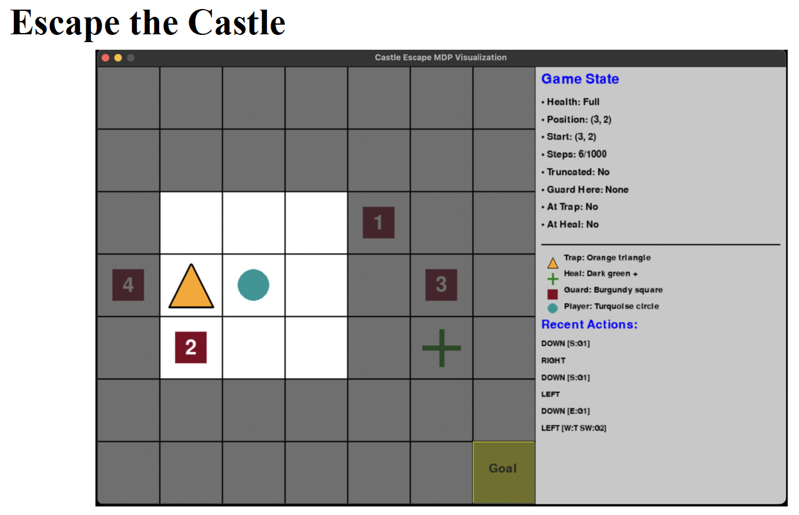

# Homework 2: Reinforcement Learning

```
Due: Monday, March 23 at 9:00 PM
```
- Start early and ask for help if needed! Run times may be long on this assignment.
- You may discuss this assignment with your classmates. However, all discussion should
    be kept at a conceptual level, and code must not be shared. Violation of this policy is
    considered a violation of the course’s academic integrity policy.
- Submitted code **must** be your own work. Any assignment that contains code that is
    identical to a classmate’s code or otherwise not your own (including code from
    classmates, AI, or other external sources) will automatically receive a 0.
- If you use any sources other than the course notes, course readings, or official Python
    documentation, please cite them. A comment at the top of your code is sufficient.
- Submit your assignment on Gradescope. Please read the submissions section for
    instructions about what files are needed. Please make sure to upload all required files and
    double check that the autograder can run your code!

## Escape the Castle



In this assignment, you will be using your knowledge of reinforcement learning to play the
Escape the Castle game. In this game, starting from a random position, your agent will need to
reach the bottom right corner of the game board. Along the way, they will need to fight or evade
guards, as well as interact with other special squares on the board.


## Basic Gameplay

The game is always played on a 7x7 grid, as shown above. Cells are labeled in a zero-indexed
manner so that the upper left corner is (0, 0) and the bottom right is (6, 6). The player’s starting
position is random, and the goal state is always in (6, 6).

There are four guards on the board, labeled G1-G4. whose positions are initialized randomly
each game and are not known to the player. Each guard also moves at random at every discrete
time step (tick) in the game. When a player enters a square with a guard, the player may choose
to hide from the guard or fight the guard. Each guard has their own strength score and keenness
score, which determines how likely these actions are to succeed. These scores remain the same
across all episodes.

Additionally, there is one “heal” square on the board. When the agent enters this square, they
may choose to take the HEAL action, which increases their health (if it was not already full).
There is also one “trap” square. Every time the agent enters this square, they immediately lose
health.

## States

This is a partially observable problem, where the agent can only see the 3x3 window of squares
surrounding its current square. (This helps limit the size of the state space.) The current state is
represented by the following pieces of information:

- **Player health:** The player has three possible health states: full, injured, and critical. The
    player’s health always begins at full and is reduced when they lose a fight. If the player’s
    health reaches the critical state, they lose the game.
- **Information about nearby squares:** For each cell in the 3x3 window, the agent knows:
    o Whether the square is a trap or heal cell
    o How many guards are present in the cell (but not which ones)
    o Whether the cell is a goal state
    o Whether the cell is out of bounds
- **Guard identity:** If the player’s current cell has a guard, they know which guard (G1-G4)
    it is.

As this description of states still leads to many potential states (many of which will never be
encountered in practice), a hash function is provided for you in the Q_learning.py file that takes
all observed local information and converts it to a unique integer.

## Actions

There are 8 possible actions, 4 of which represent motion (UP, DOWN, LEFT, RIGHT), 2 of
which enable interaction with guards (HIDE and FIGHT), and 2 additional actions (HEAL and
WAIT). While the agent may select any of the 8 actions at any time, not all actions are legal.
Selecting an illegal action will have no effect and will result in a small negative reward.


### Movement

If the player is not in the same cell as a guard, a player can move up, down, left, or right. 9 9 % of
the time, the player will move in their desired direction. 1% of the time, the player will “slip”
and move in a random undesired direction. If the player attempts to move out of bounds, they
will fail to move and will receive a small negative reward.

### Interaction With Guards

If a player is in a cell with a guard, they may only HIDE or FIGHT. A player’s chances of
succeeding in these actions are determined by the guard’s keenness (for hiding) or strength (for
fighting). A given guard’s strength and keenness are not known to the player at the start of
training, but they will be the same across all episodes.

If a player takes the HIDE action, they randomly succeed or fail, with probabilities based on the
guard’s keenness. If the player succeeds, they move to a random adjacent cell. If they fail, they
instead are forced to fight the guard.

If a player takes the FIGHT action (or fails their HIDE action), they fight the guard and
randomly succeed or fail based on the guard’s strength. If the player succeeds, they move to a
random adjacent cell. If the player fails, they also move to a random adjacent cell, but they also
lose health, possibly ending the game.

### Other Actions

If the player is in the heal cell and is not at full health, they may choose to HEAL, which
increases their health by one level. This action is not legal in any other cell (or if the player is
already at full health).

Finally, at any time (as long as the player is not in a cell with a guard), they may choose to
WAIT. This action will cause the player to do nothing, but the game will progress, and the
guards will move.

## Rewards

The rewards for this game are implemented in mdp_gym.py and are as follows:

- Reaching the Goal: +10,000 reward for successfully reaching the goal at grid (6,6).
- Winning a Fight: +100 reward for defeating a guard in combat.
- Losing a Fight: -10 penalty for losing a fight and suffering health damage.
- Defeat: -1,000 penalty if the player reaches Critical health and loses the game
- Heal: +50 reward for successfully using the HEAL action at the heal cell
- Trap: -50 penalty for entering the trap cell
- Invalid action/out of bounds: -5 penalty for taking an invalid action or attempting to
    move out of bounds (to encourage better choices)


## The Code

The mdp_gym.py file defines the underlying MDP and provides interfacing methods through
which your player can interact with the game environment. Absolutely no changes should be
made to this file unless instructed by course staff. The vis_gym.py file defines the PyGame
environment that visualizes gameplay - the GUI may help catch issues with your implemented
algorithms. Executing the command python3 vis_gym.py will launch the game in manual mode,
where you can use your keyboard to play the game with the following bindings:

- **W/A/S/D** – movement
- **E** – HEAL action
- **Space** – WAIT action
- **H** – HIDE action
- **F** – FIGHT action
- **R** – Reset/start new episode
-
You will write all your code in the Q_learning.py file. Executing “python3 Q_learning.py train”
after completing the Q-learning function will start the training process and save your final Q-
table to a pickle file that you can later load and use. Running “python3 Q_learning.py” without
any arguments will execute only the evaluation code at the bottom without a GUI. Executing
“python3 Q_learning.py gui” will start the visualizer in evaluation mode to allow you to observe
your trained agent playing the game using a saved Q-table. The gui argument may be combined
with the train argument to visualize training (as “python3 Q_learning.py train gui”), but this will
result in extremely slow runtimes; combining both arguments is recommended only for
debugging purposes.

## Your Task

You will be training an agent to play the game using Q-learning. To do so, you will be writing
the Q_learning function in Q_learning.py. You will be training your agent by playing through
many episodes of the game, using an epsilon-greedy strategy and updating a Q-table as you go.

Complete the Q_learning function by simulating n episodes, using the env.step() function to
interact with the environment. (You will likely need to experiment with the number of necessary
training episodes.) Calling env.step() at any cell returns a new observation, the reward, a Boolean
indicating whether you are at a terminal state, and some miscellaneous info about the
environment.

During training, use the epsilon-greedy approach to choose actions. This means with probability
epsilon, you should choose a random legal action. With probability 1-epsilon, instead the optimal
action: the action a that maximizes Q(s,a). At the end of the **episode** , epsilon is decreased by
multiplying it by a decay rate. The starting value and decay rate for epsilon are provided in the
code (though you may want to experiment with other values for the decay rate).


During training, we will maintain a Q-table containing values of Q(s, a) for all state-action pairs
as a dictionary, as specified in the code comments. Since the action space is very large, we will
begin with an empty dictionary and add a state to our dictionary only when we encounter it
during training. Since Q-learning is a temporal difference algorithm, we will update our Q values
immediately after each action using the equation discussed in class:
Q(s, a) ← Q(s,a) + α(R(s, a, s’) + γ * max_a’ Q(s’,a’) - Q(s, a))

To account for the fact that different states will get explored different numbers of times during
training, we will use a different value of α for each state-action pair, and we will lower these α
values over time. In particular, define:
α = 1/(1 + #of previous updates to Q(s,a))

This means that the first time Q(s, a) is updated, α will equal 1, and α will then decrease as more
updates occur. In order to keep track of this, you will need some way to track the number of
times each Q-value has been updated in the past. This could be a matrix of shape (num. states,
num. actions), another dictionary, or a data structure of your choice. Using this data structure,
you can calculate α directly before each update.

## Some Rules

In order to properly implement Q-learning and demonstrate what your agent can learn “on its
own”, it is crucial that you do not hard code actions or interact with the environment in any
additional ways. Therefore, all solutions must follow the following rules.

**1.** You **must** use the env.step() function to interact with the environment. Variables listed
    under the constructor (def __init__(self): in mdp_gym.py) may be accessed, but not
    modified directly from within your code.

**2.** No other functions except env.step(), env.reset(), and env.action_space.sample() that are
    defined in mdp_gym.py or vis_gym.py may be called from within your code.
    
**3.** No agent behavior should be hard-coded. This includes hard-coding what actions are
    legal or illegal. The agent should always select between **all** actions based on the epsilon-
    greedy strategy and should learn to avoid illegal actions over the course of training.

Solutions that break one or more of these rules **will** lose points, and in extreme cases, may
receive a 0.

## Results and Deliverables

You will need to submit a zip file called **upload.zip** , which must hold **3 files** : your
**Q_learning.py** file, a pickle file holding your final Q-table called **Q_table.pickle** (which will be
automatically generated by the provided code), and a PDF called **results.pdf**. Please double
check that you have included all three files and that they are named correctly! Missing files and
incorrect names may cause the autograder to malfunction.


Your results PDF will include some basic information about your trained model, along with
some required figures. Please note that you will need to write additional code and/or run your
agent in “evaluation mode” (over 10,000 episodes as in the provided code) to generate some of
these results.

In your results file, please include the following pieces of information:

- The decay rate and number of training episodes in your final trained model
- The average length of an episode among the 10,000 evaluation episodes
- The average reward across all 10,000 evaluation episodes
- The number of unique states in your final Q-table
- The number of unique states encountered during evaluation that were **not** in the Q-table
    and the percentage of actions during your 10,000 episodes that were taken from one of
    those states

Additionally, you will need to include two graphs/charts, both of which must be clear, legible,
and well organized. The first is a graph recording the rewards at the end of each episode of
**training**. I recommend adding functionality to your Q-learning function to keep track these
rewards as you go, and you may want to use a package like matplotlib to generate the graph
(though this is not required, as long as your graph is clear and readable).

The second is 5x8 table that summarizes your Q-table in several critical states. Each row
corresponds to a set of states; the first row corresponds to all states where the agent is in the heal
cell, and each of the remaining four rows corresponds to states where the agent is in the same
cell as a guard (with a separate row for each guard G1-G4). Each column represents one of the 8
actions, and each cell should represent the **average** Q-value for the given action in the given
state. (You will need to take a **weighted average** across all relevant states in your Q-table, where
each individual state’s weight is determined by the number of times it was encountered during
training.)

## Grading

This assignment will be graded using a mix of automatic and manual grading. For Q-learning,
the autograder will assign points based on the rewards earned by your final trained agent over
several episodes of training. (Partial credit will be possible.) Once the autograder has been
released, you may upload your current solution to Gradescope as many times as you like to see
your current autograder score. Your final autograder grade will be based on the submission you
mark as active. Submissions that receive poor autograder scores due to misnamed files, buggy
code, or other issues may receive points in manual grading but will **not** be regraded, so please
make sure you are satisfied with your autograder score before the final deadline! Additionally,
any attempts to hardcode solutions or manipulate the autograder will automatically receive a 0.

Manual grading will assess how well you implement the Q-learning algorithm, including
properly using the gymnasium environment, properly updating your Q-table, and properly using
the epsilon-greedy strategy. Manual grading will also evaluate your results file for clarity and
correctness. You may gain (or lose) points in manual grading, regardless of how well your code
performs in the autograder.
